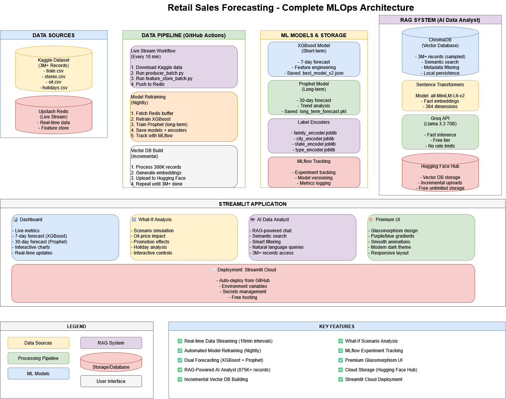

# 🛒 End-to-End Real-Time Retail Demand Forecasting System

[](https://retail-forecast-redis.streamlit.app/)


### 🚀 Live Demo

**[Click here to view the Live Dashboard](https://retail-forecast-redis.streamlit.app/)**
_(Note: If the live data is $0, hit the "Refresh" button. The background pipeline updates every 5 minutes.)_

---

## 📖 Project Overview

This project is a production-grade **MLOps pipeline** designed to forecast retail sales in near-real-time. Unlike static notebooks, this system is a living ecosystem that ingests live data, updates a feature store, automatically retrains the model nightly, and serves predictions via an interactive dashboard.

**The Business Problem:** Retailers struggle with inventory management because demand fluctuates rapidly.
**The Solution:** A self-healing AI system that adapts to new data trends automatically without manual intervention.

## 🏗️ System Architecture

I designed a **Serverless Micro-Batch Architecture** to maintain a production-grade pipeline with **$0 operational costs**.

## 

## 🛠️ Tech Stack

- **Data Ingestion:** Kaggle API (Automated ETL), Redis Streams (Message Queue).
- **Feature Store:** Upstash Redis (Serverless Key-Value Store).
- **Machine Learning:** XGBoost Regressor (Gradient Boosting).
- **Experiment Tracking:** MLflow & Dagshub.
- **Orchestration (CI/CD):** GitHub Actions (Scheduled Cron Jobs).
- **Frontend:** Streamlit (Python-based UI).
- **Language:** Python 3.11.

---

## ⚙️ Key Features & Engineering Decisions

### 1\. Serverless "Micro-Batch" Ingestion

Instead of running an expensive 24/7 EC2 instance, I utilized **GitHub Actions** to act as a cron scheduler.

- **Producer:** Wakes up every 5 minutes, downloads the latest dataset from Kaggle, simulates 50 random transactions with _current timestamps_ (Time-Travel Logic), and pushes them to Redis.
- **Processor:** Wakes up, processes the stream, and shuts down.
- **Benefit:** 100% Free, fault-tolerant, and mimics a real-world streaming environment.

### 2\. Time-Bucketed Feature Store

Raw stream data is useless for ML. The processor aggregates raw sales into three distinct time buckets in Redis:

- `feature:sales_daily`
- `feature:sales_weekly`
- `feature:sales_monthly`
- **Benefit:** Low-latency lookup (\<10ms) for the dashboard without querying a heavy SQL database.

### 3\. Automated Continuous Training (CT)

Models degrade over time (Data Drift). This pipeline fights drift by:

- Downloading the full dataset (Oil prices, Holidays, Stores) every night.
- Merging and engineering 12 complex features.
- Training a new **XGBoost v2** model.
- Automatically committing the new model (`sales_model_v2.json`) to the repo if performance improves.

### 4\. Advanced Feature Engineering

The model doesn't just look at sales history. It joins multiple datasets to understand context:

- **Oil Prices:** Filled missing weekend data using forward-fill to capture economic trends.
- **Holidays:** Filtered "Transferred" holidays to identify true high-demand days.
- **Cyclical Features:** Extracted Day of Week, Month, and Year.

---

## 📂 Project Structure

```bash
├── .github/workflows/
│   ├── live_stream.yml    # Runs every 5 mins (Ingestion)
│   └── retrain.yml        # Runs daily (Model Training)
├── data/                  # (Ignored by Git) Holds temp Kaggle data
├── dashboard.py           # The Streamlit Frontend application
├── producer_batch.py      # Generates synthetic live data
├── feature_store_batch.py # Aggregates data into Redis
├── train.py               # Advanced training logic (joins 5 datasets)
├── sales_model_v2.json    # The trained XGBoost artifact
├── requirements.txt       # Python dependencies
└── README.md              # Project documentation
```

---

## 🏃‍♂️ How to Run Locally

If you want to run this pipeline on your own machine:

1.  **Clone the repository:**

    ```bash
    git clone https://github.com/RobinMillford/retail-forecast.git
    cd retail-forecast
    ```

2.  **Install dependencies:**

    ```bash
    pip install -r requirements.txt
    ```

3.  **Set up Environment Variables:**
    Create a `.env` file in the root directory with the following keys:

    ```ini
    UPSTASH_REDIS_REST_URL="your_url_here"
    UPSTASH_REDIS_REST_TOKEN="your_token_here"
    MLFLOW_TRACKING_URI="your_dagshub_uri"
    MLFLOW_TRACKING_USERNAME="your_username"
    MLFLOW_TRACKING_PASSWORD="your_token"
    # Kaggle keys are needed if running training locally
    ```

4.  **Run the Dashboard:**

    ```bash
    streamlit run dashboard.py
    ```

5.  **Simulate Data (Optional):**
    Open a separate terminal and run:

    ```bash
    python producer_batch.py
    python feature_store_batch.py
    ```

---

## 🔮 Future Improvements

- **Drift Monitoring:** Integrate **Evidently AI** to send alerts when the data distribution shifts significantly.
- **API Deployment:** Wrap the model in a **FastAPI** container for serving predictions via REST.
- **Deep Learning:** Experiment with LSTM or Prophet for long-term sequence forecasting.

---

_Built by Yamin_
